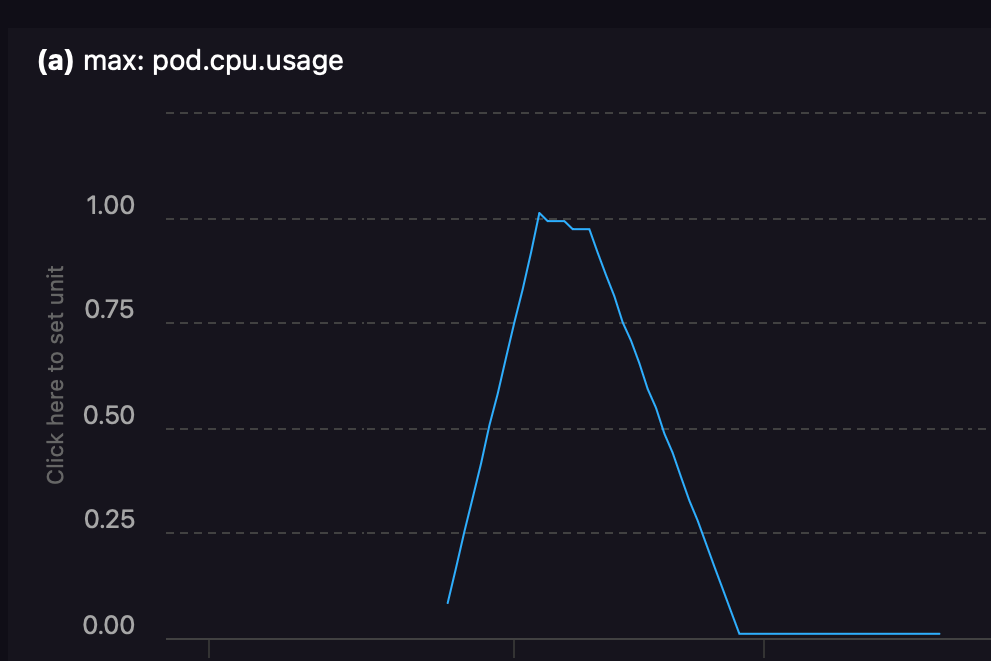

# Flutter


Flutter takes a script in YAML and generates metrics and other
telemetry to simulate various test scenarios.

A metric emitter is defined that has a start time and various
configuration options (aka "spec") and metrics can refer to
these emitters to form telemetry.  Emitters can be altered
at different points in time.  Metrics can use one or more
emitter to form the datapoint values.

## Usage

```sh
flutter confg.yaml [other.yaml ...]
```

The options are one or more configuration files in YAML format.  They are
merged while loading, with the later options (usually) overwriting the
earlier ones.

### Example

```sh
% flutter sample-dryrun.yaml sample-config.yaml
2025/04/30 10:44:12 INFO MetricGauge Emit ts=10s metricName=pod.cpu.usage value=8.603450562309138
2025/04/30 10:44:12 INFO MetricGauge Emit ts=20s metricName=pod.cpu.usage value=8.9923406286904
2025/04/30 10:44:12 INFO MetricGauge Emit ts=30s metricName=pod.cpu.usage value=9.15036693509603
2025/04/30 10:44:12 INFO MetricGauge Emit ts=40s metricName=pod.cpu.usage value=7.507197702329614
2025/04/30 10:44:12 INFO MetricGauge Emit ts=50s metricName=pod.cpu.usage value=9.966095793585012
2025/04/30 10:44:12 INFO MetricGauge Emit ts=1m0s metricName=pod.cpu.usage value=61.27401607743047
2025/04/30 10:44:12 INFO MetricGauge Emit ts=1m10s metricName=pod.cpu.usage value=62.90178020482533
2025/04/30 10:44:12 INFO MetricGauge Emit ts=1m20s metricName=pod.cpu.usage value=58.31397815651833
2025/04/30 10:44:12 INFO MetricGauge Emit ts=1m30s metricName=pod.cpu.usage value=61.26050101150872
2025/04/30 10:44:12 INFO MetricGauge Emit ts=1m40s metricName=pod.cpu.usage value=60.841981633174264
2025/04/30 10:44:12 INFO MetricGauge Emit ts=1m50s metricName=pod.cpu.usage value=58.18683152763096
2025/04/30 10:44:12 INFO MetricGauge Emit ts=2m0s metricName=pod.cpu.usage value=60.589915194816385
```

## Configuration

This and other samples are in the various `sample-*.yaml` files.

```yaml
duration: 120s
seed: 123456789
#wallclockStart: 2000-01-01T00:00:00Z
script:
  - type: metricEmitter
    name: constant10
    spec:
      type: constant
      value: 10
  - type: metricEmitter
    name: random5
    spec:
      type: randomWalk
      target: 0
      stepSize: 4
      elasticity: 0.5
      variation: 10
  - type: metric
    name: pod.cpu.usage
    spec:
      attributes:
        resource:
          k8s.cluster.name: fakecluster
          k8s.namespace.name: fakenamespace
          k8s.pod.name: fakepod
      type: gauge
      frequency: 10s
      emitters:
        - constant10
        - random5
  - type: metricEmitter
    at: 60s
    name: constant10
    spec:
      type: constant
      value: 60
```

### Run State

* `duration` is optional, and will be computed from the last script `at` value plus one second.
* `seed` is optional, but recommended to produce repeatable scripts.  If it is not set, the current time is used as a seed, resulting in different output each run for components that use randomness.
* `otlpDestination` defines where to produced telemetry.
* `wallclockStart` is optional.  If unset, the current time is used.  Otherwise, the script will simulate starting at this time.
* `dryrun` indicates that the script should run as fast as possible and produce no metric output.

### Script

The script defines what happens, and when.  Each script element has several common fields:

* `at` is when this component state is applied.
* `type` indicates the type of component.
* `name` is the name of the component.  Various components use the name differently.
* `spec` is the component definition.

### Component Types

* `metricEmitter` defines a component that produces a floating point value.  These are typically defined once at time `0` and then modified later to change based on the metric output wanted.
* `metric` defines a metric that is emitted on a timer, based on its spec.  Metrics use a series of `metricEmitters` to build their values.

### Emitters

#### Constant

Constant emitters always produce the same value.  When redefined, they will jump directly to the new value.

```yaml
spec:
  type: constant
  value: 60
```

#### Ramp

Ramp emitters use linear intrepolation from `start` to `target` over the time `duration`.Once they reach their `target`, that value is emitted for all future samples.  Prior to the start time, the `start` value is emitted.

When a ramp is reconfigured, the current value is used as the new starting value, and the new rule takes over immediately.  For example, if a ramp is from 10 to 100 over 10m, and at 5m it is changed, the interpolated value will be used as a start for the new ramp shape.



```yaml
duration: 10m
seed: 123456789
script:
  - type: metricEmitter
    name: ramp
    spec:
      type: ramp
      target: 1.0
      duration: 2m
  - type: metric
    name: pod.cpu.usage
    spec:
      attributes:
        resource:
          k8s.cluster.name: fakecluster
          k8s.namespace.name: fakenamespace
          k8s.pod.name: fakepod
      type: gauge
      frequency: 10s
      emitters:
        - ramp
  - type: metricEmitter
    at: 2m
    name: ramp
    spec:
      type: ramp
      target: 0.75
      duration: 8m
  - type: metricEmitter
    at: 3m
    name: ramp
    spec:
      type: ramp
      target: 0.01
      duration: 3m
```

#### Random Walk

Random Walk emits a mean-reverting noise term. For each sample `x`, the internal state steps like:

`x ← x + elasticity*(target - x) + Uniform(−stepSize,+stepSize)`

It is then clamped into `[target−variation, target+variation]`.

If a constant is desired, variation can be set to 0, which will clamp to the target.  Random samples are still generated, but the output will be constant.

```yaml
spec:
  target: 0
  elasticity: 0.2
  stepSize: 2
  variation: 10
```

### Exporters

#### Metric

A metric exporter emits values at some defined rate, using one or more emitters to define each emitted sample.  The component `at` indicates when the metric should fist appear.  It is common to omit `at`, causing the metric to always be present.  The component `name` will be used as the metric name by default, but it can also be included in the `spec`, allowing multiple metrics with the same name but different attributes.

Metrics have these common fields:

* `attributes.resource`, `attributes.scope`, and `attributes.datapoint` define the OpenTelemetry metric resource, scope, and datapoint attributes for each sample emitted.
* `emitters` is a list of metric emitters that will be used to calculate each sample.  At least one is required.
* `frequency` is the rate at which this metric will be produced.  Defaults to `10s`.
* `type` sets the type, such as `gauge` or `counter`.  Types may include additional fields.
* `name` sets the metric name used during export.  This defaults to the componet name if not set.

## Producing Metric Output

The top-level `otlpDestination` defines how to send OTLP-format telemetry.  This is
usually an OpenTelemetry `otlp` http receiver.

Fields:

* `endpoint` defines the base endpoint, usually without a path, such as `https://example.com:1234`
* `headers` defines a `map[string]string` of headers to send with each HTTP request.
* `timeout` sets the maximum wait time for the post to complete.  Defaults to `5s`.

## Future Work

* Add a way to more carefully tune the sampler pipeline, with clamping, simple math, etc.  This would probably be inside the
